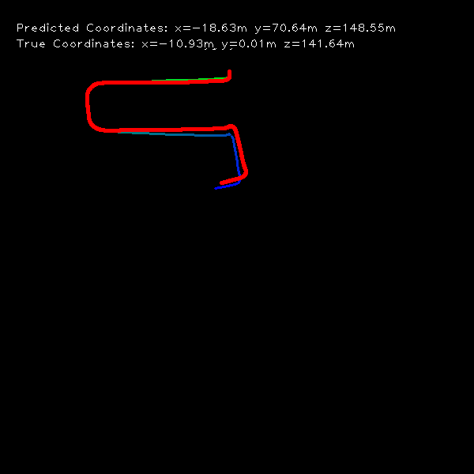
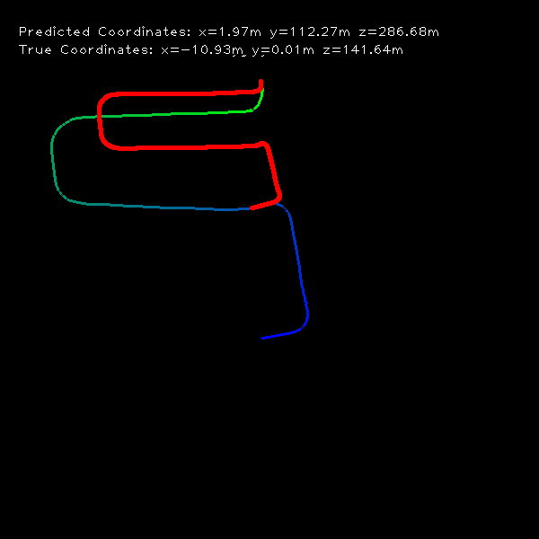

# Monocular Visual Odometry (monoVO)

**Keywords:** FAST Feature Detection, LK Feature Tracking, Five-Point Motion Estimation

<p float="left">
  
  
</p>


### Requirements
* Python 3.6.4
* Numpy
* OpenCV
* utm

### Dataset
This repository enables the use of tracking data set
[KITTI tracking data set (Left Color, GPS/IMU data, 15 GB)](http://www.cvlibs.net/datasets/kitti/eval_tracking.php)

Or, you can use the original odometry data set
[KITTI odometry data set (grayscale, 22 GB)](http://www.cvlibs.net/datasets/kitti/eval_odometry.php)
 
### Usage
- Modify the path in test.py to your image sequences and ground truth trajectories, then run
```
python test.py 0007
```

- Use ground truth to calculate absolute scale, add
```
--use_abs_scale
```

- To skip frames, add
```
--skip_frame 2
```
 

### References
- This repository is from [monoVO-python](https://github.com/uoip/monoVO-python)
- [Monocular Visual Odometry using OpenCV](http://avisingh599.github.io/vision/monocular-vo/) and its related project report [_Monocular Visual Odometry_](http://avisingh599.github.io/assets/ugp2-report.pdf) | Avi Singh
